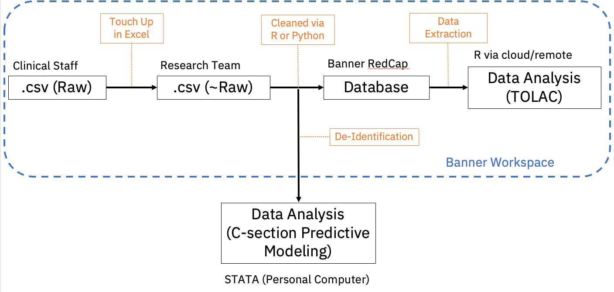

### Data Management Plan
This plan is to complete the task of building a "Labor & Delivery" database in Banner RedCap that is available to be used for research projects. Currently, there are two research projects attached, an investigation of characteristics that lead to successful TOLAC (Trial of Labor after Cesarean) and a predictive model for c-sections.

#### 1. Data Description
This dataset contains about 50 variables that relate to the conditions of the delivery including birthweight, type of delivery, risk factors, etc. It does contain personal identifiers including name, day of delivery, and medical ID numbers. 

#### 2. Data Collection
The data is currently collected by the nurses and doctors who work with pregnant women in the Banner network. This data is collected and sent to a government organization for auditing purposes, but it also can be pulled from the Cerner systems.

#### 3. Data Storage & Backup
The .csv files are kept by the nurses, but the goal of the research team is to upload the data into a Banner RedCap system. During this process, the .csv files will be stored in a OneDrive on Banner's network. 

#### 4. Data Organization & Documentation
The primary identifier for the data is the names and the medical record numbers, and all variables are associated with these identifiers. If needed, a research record id will be assigned to each patient to further de-identify the data. This is subject to Banner Policies and IRB review. 

#### 5. Data Preservation and Long-Term Access
Once the database is built in Banner Redcap, it can be maintained by the clinical research coordinator for the OB/GYN department. The data cleaning scripts will be shared as well so that future data can be uploaded into RedCap. 

#### 6. Data Sharing and Access
Access to this RedCap database will be given to interested Doctors and Residents who wish to analyze the data for research projects. The data will remain within Banner employees and associates.  

#### 7. Data Ethics and Legal Compliance
All research will be subject to IRB approval and all use of data will be in accordance with Banner policies. 

#### 8. Roles and Responsibilities
The interested clinical teams will request the data and send it to the research team. The research team will clean the data and upload it to the database. The research team will further complete the needed data analysis in the appropriate statistical software. 

#### 9. Budget & Resources
This work is part of the expected research responsibilities of the clinicians and the research team (via the University of Arizona).

### Proposed Data Workflow
Below is a proposed workflow for the research data. 

